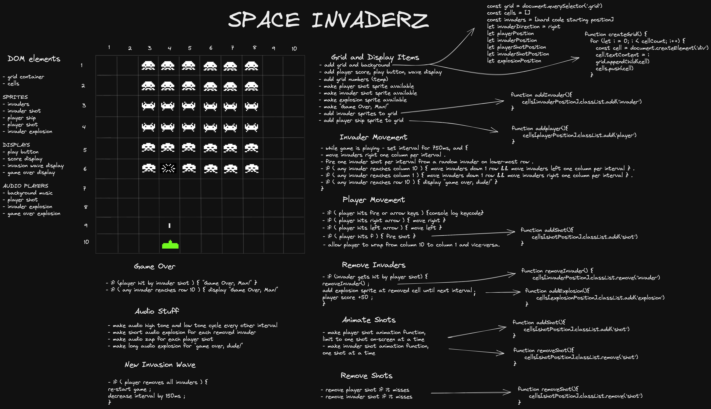

# Space Invaderz

### SEI62 Project 1 Overview

This grid-based game was my first project while attending the General Assembly Software Engineering Immersive course, and is my first attempt at programming a video game.

PROJECT DURATION: 7 days.

TECHNOLOGIES USED: HTML, CSS, JavaScript.

**LINK:** Play Space Invaders [here].

### The Brief
Our brief was to create a grid-based game using only JavaScript, CSS, and HTML, and effect the game movement using css classes.

For the Space Invaders brief specifically, the requirements stated that:

The player should be able to clear at least one wave of aliens.
The player's score should be displayed at the end of the game.

### Day 1 - Starting Out

I spent the first day and a half whiteboarding and psuedo-coding the game using Excalidraw. I wanted to have a good idea of what was needed, break it down into smaller, more approachable tasks. I enjoyed using Excalidraw, the hand-drawn look is nice and gives a great vibe.

### Day 2 - Collecting and Preparing Assests, Building the Grid and Player

I finished off my whiteboard as much as I had the patience to do, thought about all the cool things I wanted to do, decided which ones I would actually do first and what would be "stretch goals". I hopped on Google, found assets for the sprites that looked authentic, found the original sounds from the 1980 arcade version, and decided upon the pixel font that would be used for the displays. Additionally, I found a site that had artwork overlays from numerous versions on different platforms over the years, and was lucky to find the original big yellow and orange logo. I made the logo transparent, resized the sprites, and converted the audio files so that they played at the correct rate. 

With all the assets in hand I started coding the game. I built the grid, added the player, and added the invader fleet. The displays and logo were popped in and I called it a night.

### Day 3 - Styling the Game

I knew that I would be busy adding extra feaaures and debugging at the end so I got the styling out of the way. I was going for an authentic retro feel, and so made it minimal and kept it oldskool. During the styling I left temporarily displayed the array position numbers for each grid and displayed borders on all the cells, to help with programming later on. The numbering was invaluable when I built the movement logic the following day. The grid display helped with deciding and styling the invader placement. I felt happy because my CSS was relatively straight forward and worked as planned without any hitches. 

### Day 4 - Making the Collision and Movement Logic

I got to work building the movement for the player, the player shots, and the invader fleet. I got them all moving correctly and added the player shots. Things looked like they were kinda working when I noticed the console was stuck on an angry red infinite loop. I'd forgotten to define the boundaries for the missed shots that left the array, so got that sorted and my console was happily blank again. At this point I had cobbled together a function to move the invading fleet and everything appeared well - for the moment. Directly following the movement function call the invaders starting going in random places and directions, followed by the angry red infinte loop on the console again. I defined the bottom collision boundaries, console looks happy - no more red, but the invaders were still bugging out, and I was left scratching my head..

### Day 5 - Bugs and Re-Structuring 
The next morning I had a think and decided to rewrite everything to do with the invaders array and the positions of the invaders on the grid. I had initially made them objects and given them the properties 'position' and 'type' , storing the location of each invader and it's associated ship-type within itself.  In hindsight I probably could have kept it this way, but I was freaking out about my movement function and so I stripped back the array of objects to a more simple integer array, and finished the movement function again. Checked it with one invader, then a fleet, movement looks great, but as soon as a player shot hits one they just bug out again.  At that point I busied myself with getting the score and level displays linked up and made a toggle button to pause the gameplay. I was stumped and then someone pointed out most kindly that I was attempting to reference the wrong object. One pair of deleted brackets later the invaders were marching like redcoats . I made a zigzag sprite and put in the bomb function. Eventually I settled on running the bomb function on the same clock as the invader movement. 

### Day 6 - Adding the Stretch Goals and More Bugs
Added cool css background stars. Added a flying saucer attack across the top. Added sounds. Added bugs. 

### Day 7 - Presentation 
Got the bugs fixed and did the game presentation. It was amazing to see the sheer variety and creativity of the cohort, the support and positivity added to the fun of playing games for hours!

Thanks to Tristan, Nick, Simon, Milo and all of the cohort for a wicked fun challenge! 

